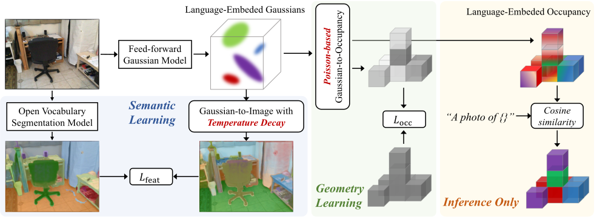

<h1 align="center">LegoOcc: Monocular Open Vocabulary Occupancy Prediction for Indoor Scenes</h1>

<p align="center">
  <span style="color:#c00000; font-size: 18px;"><strong>CVPR 2026 Oral</strong></span>
</p>

<p align="center"><strong>
    <a href="https://scholar.google.com/citations?user=FZ3jPs4AAAAJ">Changqing Zhou</a><sup>1</sup>,
  <a href="https://scholar.google.com.hk/citations?user=B588EyYAAAAJ">Yueru Luo</a><sup>2</sup>,
  <a href="https://github.com/hanzhang-tech">Han Zhang</a><sup>1</sup>,
  <a href="https://scholar.google.com/citations?user=i3Lr8_8AAAAJ">Zeyu Jiang</a><sup>1</sup>,
  <a href="https://scholar.google.com/citations?user=OqlY-98AAAAJ">Changhao Chen</a><sup>1 ✉</sup>
</strong></p>

<p align="center"><strong>
    <sup>1</sup>The Hong Kong University of Science and Technology (Guangzhou)<br>
    <sup>2</sup>The Chinese University of Hong Kong, Shenzhen
</strong></p>

<p align="center"><sub>✉ Corresponding author.</sub></p>

<p align="center"><strong>
    <a href="https://juivyy.github.io/legoocc/">Project Page</a> |
    <a href="https://arxiv.org/abs/2602.22667">Paper</a>
</strong></p>

<p align="center">
  
</p>

**LegoOcc** tackles **monocular open-vocabulary 3D semantic occupancy prediction** in **large-scale indoor scenes** under **geometry-only supervision**. It represents scenes as **Language-Embedded Gaussians**, introduces an **opacity-aware Poisson Gaussian-to-Occupancy** operator for stable volumetric aggregation, and adopts **Progressive Temperature Decay** to strengthen Gaussian-language alignment during training.

The framework is designed for open-vocabulary indoor occupancy reasoning from monocular observations, bridging sparse Gaussian scene modeling and language-aware 3D occupancy prediction.

## News

- [2026.05] :rocket: Code is released
- [2026.04] :microphone: **LegoOcc was accepted to CVPR 2026 (Oral).**


## Documentation

For setup and usage details, please refer to the documents under [`docs/`](docs):

- [`docs/install.md`](docs/install.md): environment setup, dependency installation, and pretrained component preparation.
- [`docs/data.md`](docs/data.md): dataset preparation for **OccScanNet**, folder structure, and symbolic link setup.
- [`docs/train_eval.md`](docs/train_eval.md): training workflow, configuration notes, and runtime environment variables.

## Getting Started

1. Follow [`docs/install.md`](docs/install.md) to prepare the environment.
2. Follow [`docs/data.md`](docs/data.md) to organize the dataset.
3. Follow [`docs/train_eval.md`](docs/train_eval.md) to launch training.

## Citation

If you find this work useful, please consider citing:

```bibtex
@inproceedings{zhou2026monocular,
  title={Monocular open vocabulary occupancy prediction for indoor scenes},
  author={Zhou, Changqing and Luo, Yueru and Zhang, Han and Jiang, Zeyu and Chen, Changhao},
  booktitle={Proceedings of the IEEE/CVF Conference on Computer Vision and Pattern Recognition},
  pages={21627--21637},
  year={2026}
}
```

## Related Projects

We recommend checking out the following related projects:

- [EmbodiedOcc: Embodied 3D Occupancy Prediction for Vision-based Online Scene Understanding](https://github.com/YkiWu/EmbodiedOcc/tree/main)
- [GPOcc: Generalizing Visual Geometry Priors to Sparse Gaussian Occupancy Prediction](https://github.com/JuIvyy/GPOcc)
- [FreeOcc: Training-Free Embodied Open-Vocabulary Occupancy Prediction](https://github.com/the-masses/FreeOcc)
